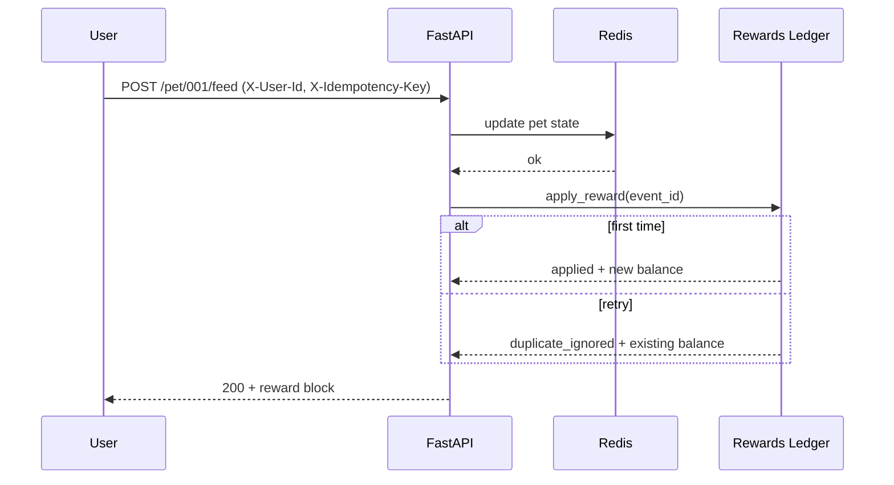
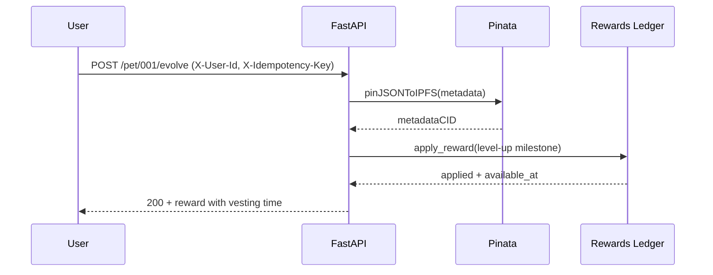
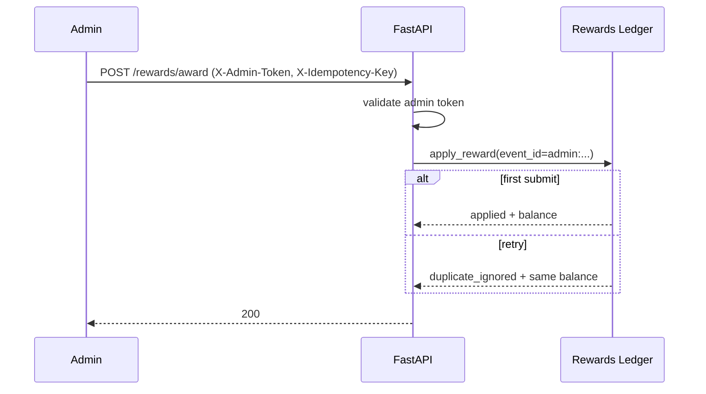

# BROski$ Rewards + HyperCode Integration Spec (P3)

This spec defines a production-safe reward system for BROski$ that plugs into the BROskiPets API.
It is designed to be:
- idempotent (safe retries)
- auditable (full ledger trail)
- abuse-resistant (rate limits + validation)
- portable (SQLite for dev, Postgres for prod)

---

## 1) Reward Rules Specification

### 1.1 Identity + Eligibility

Rewards are only processed when the request includes:
- `X-User-Id`: stable user identity from HyperCode / auth layer
- `X-Idempotency-Key`: stable unique key per client action attempt

If `X-User-Id` is missing: rewards are not attempted.  
If `X-Idempotency-Key` is missing: rewards are skipped with `status=skipped_missing_idempotency`.

### 1.2 Multipliers

Pet rarity multiplies rewards:
- Common: 1.0×
- Uncommon: 1.1×
- Rare: 1.25×
- Legendary: 1.5×
- Quantum: 2.0×

Final amount is `round(base_amount * multiplier)`.

### 1.3 /feed Rewards (HyperCode Action Mapping)

The `/feed` endpoint supports a semantic `action` field:
- `feed` (default)
- `like`
- `comment`
- `share`
- `post`

Base amounts:
- feed: +2
- like: +1
- comment: +2
- share: +3
- post: +5

Eligibility validation hooks:
- require `X-User-Id` + `X-Idempotency-Key`
- optional `target_id` for linking to HyperCode content

Rate limit:
- max 50 rewards/day/user for `/feed` actions (shared bucket)

### 1.4 /chat Rewards

Rewards are only granted when message is NOT blocked by the injection guard.

Base amounts:
- per message: +1
- first chat of day bonus: +5
- quality bonus: +1 if message length >= 40 chars

Rate limit:
- max 40 rewards/day/user for chat events

### 1.5 /evolve Rewards

Triggered only when `new_level > previous_level` (level-up).

Milestone amounts:
- level 2: +10
- level 3: +25
- level 4: +100 (vest 24h)
- level 5: +250 (vest 24h)
- level 6: +1000 (vest 24h)

Rate limit:
- max 10 evolve rewards/day/user

### 1.6 Distribution Schedule + Vesting

Ledger entries include `available_at`:
- small rewards: immediately available (`available_at = created_at`)
- milestone rewards >= 100: vest for 24 hours

Future expansion:
- weekly on-chain distribution by snapshotting available balances
- claim contract optional (not in this repo yet)

---

## 2) Idempotent Ledger Touchpoints Architecture

### 2.1 Event Model

Each reward attempt has:
- `event_id` (unique): derived from `{endpoint}:{user_id}:{pet_id}:{trigger}:{idempotency_key}`
- `status`: `applied | duplicate_ignored | blocked_rate_limited | skipped_missing_idempotency`

### 2.2 Atomic Processing

Processing is a single DB transaction:
1) optional rate-limit counter increment (or reject)
2) insert ledger entry (unique `event_id`)
3) update `user_balances`

If step (2) violates the unique constraint:
- treat as duplicate retry
- return `duplicate_ignored` without altering balances

### 2.3 Rollback + Failure Semantics

Any unexpected exception rolls back the transaction.

Client retry policy:
- retry on 5xx with the same `X-Idempotency-Key`
- do not retry with a new key (would create a new reward event)

### 2.4 Audit Trail

Ledger stores:
- full metadata JSON blob for the event
- timestamps: `created_at`, `available_at`
- links: `user_id`, `pet_id`, `endpoint`, `trigger`

---

## 3) Endpoint Integration Mapping

### 3.1 /pet/{pet_id}/feed

Trigger points:
- successful state update (feed applied)
- optional HyperCode action mirror via `action` + `target_id`

Touchpoint:
- insert ledger entry after the pet action succeeds

### 3.2 /pet/{pet_id}/chat

Trigger points:
- message accepted (not blocked)
- first message of day yields bonus

Touchpoint:
- insert ledger entry after response is generated

### 3.3 /pet/{pet_id}/evolve

Trigger points:
- level increases (based on XP thresholds)
- milestone rewards vest when large

Touchpoint:
- insert ledger entry after metadata CID is produced (and optional on-chain tx submitted)

---

## 4) Technical Implementation Requirements

### 4.1 Database Schema

SQLite migration:
- `migrations/sqlite/001_rewards_ledger.sql`

Postgres migration:
- `migrations/postgres/001_rewards_ledger.sql`

Tables:
- `ledger_entries` (idempotency + audit)
- `user_balances` (fast balance lookup)
- `rate_limit_counters` (abuse control)

### 4.2 API Contract (Headers)

Required for rewards:
- `X-User-Id: <string>`
- `X-Idempotency-Key: <string>`

Admin grant endpoint:
- `POST /rewards/award`
- Required headers:
  - `X-Admin-Token: <secret>` (must match server `REWARDS_ADMIN_TOKEN`)
  - `X-Idempotency-Key: <string>`
- Body:
  - `user_id`, `amount`, `reason`
  - optional: `pet_id`, `source`, `vest_hours`, `metadata`

### 4.3 Errors + Retries

- Missing user id: no reward attempt
- Missing idempotency: `reward.status = skipped_missing_idempotency`
- Rate limited: `reward.status = blocked_rate_limited`
- Duplicate retry: `reward.status = duplicate_ignored`

### 4.4 Performance Benchmarks (Target)

Target: 10,000+ concurrent reward operations.

Implementation notes:
- SQLite is acceptable for local dev and small throughput.
- For 10k concurrency, production should use Postgres + pooled connections.

---

## 5) Sequence Diagrams

### 5.1 /feed Reward (Idempotent)

### 5.2 /evolve Milestone Reward + Vesting

### 5.3 Admin Manual Grant (Idempotent)

